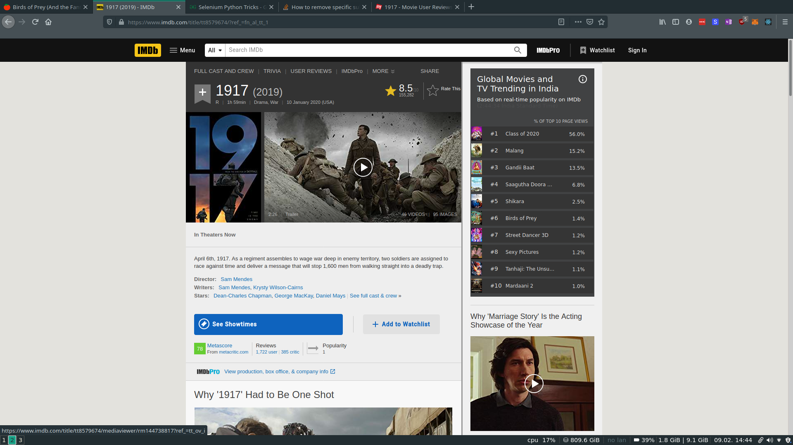
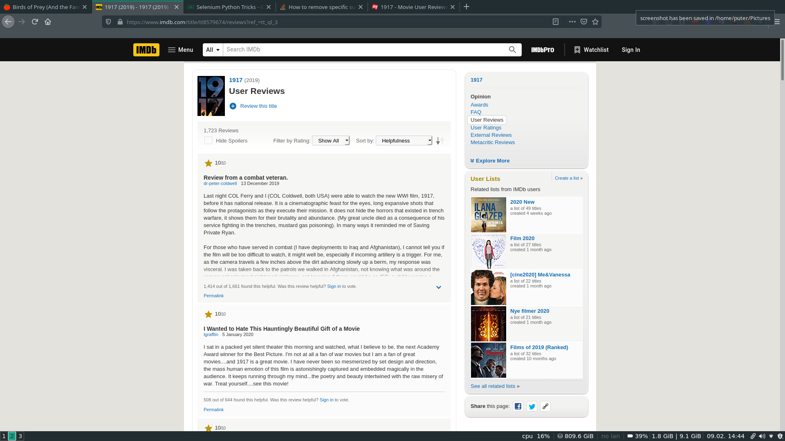
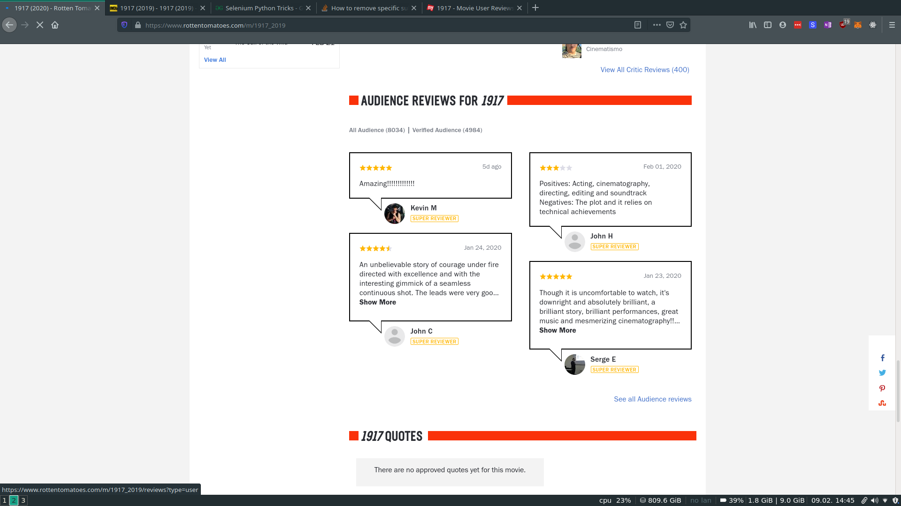
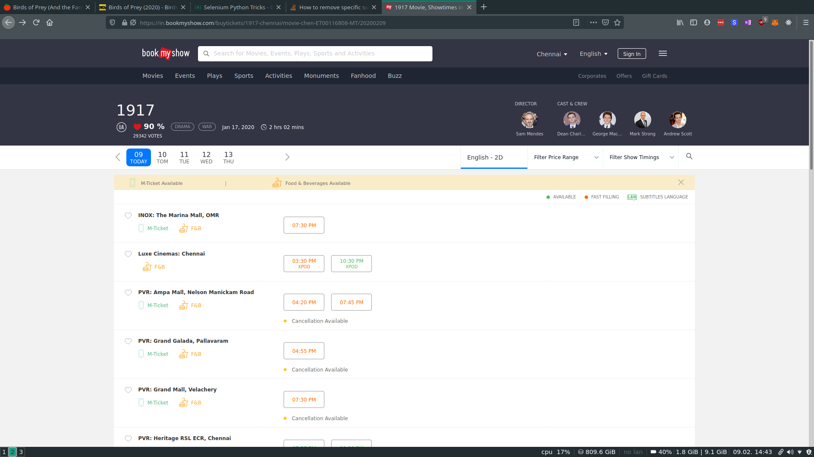
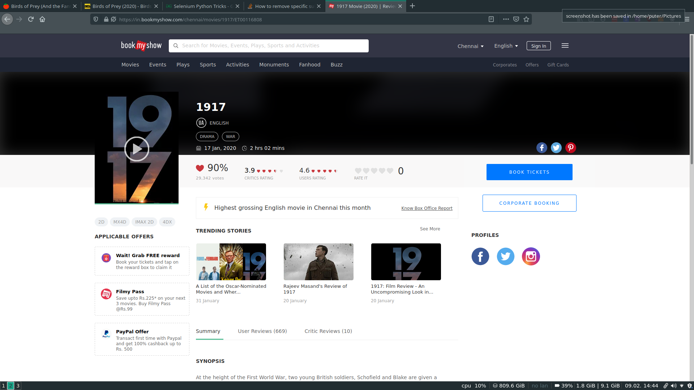
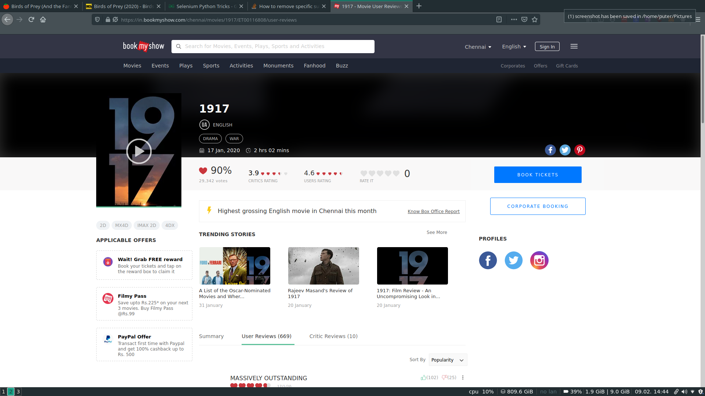

# movie-maniac
Web scraping+sentiment analysis for movie review

## Prerequisites

Clone the Repository:
```git clone https://github.com/abhijithneilabraham/movie-maniac```

Then go to the working directory.

```cd movie-maniac```

In the working directory,

To install all the dependencies, run:

``` pip install --user -r requirements.txt ```

Before running the programs,first run the ```firstrun.py``` .This is important for nltk to download all the required packages.

## Running the program
 
 Go to the final_version folder (If you are using windows or linux, then use this folder, else if you're using a mac,use the final version macos folder).
 
 Run ```combined.py```
 
 Enter the filename and links as asked.
 
The format for getting links are as shown below.


## Getting imDb link:

1. Go to the movie's page and click on "User Reviews"


2. Copy the link from the address bar.


## Getting Rotten Tomatoes link:

1. Go to the movie's page and scroll down to reviews section.

Click on "see all audience reviews"


2. Copy the link from the address bar.


## Getting Book My Show link:

1. Go the movie's page and click on the Movie's name which is in bold letters.


2. Click on User Reviews.


3. Copy the link from the address bar.


